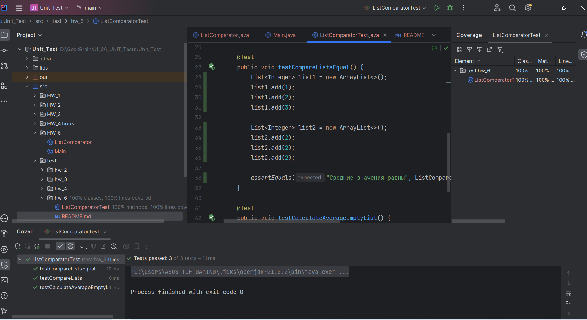

### Отчёт о покрытии:

### В представленных JUnit-тестах покрыты следующие сценарии:

1. Сравнение списков с разными средними значениями: 
    В этом сценарии мы создаем два списка с разными наборами чисел, чтобы убедиться, что программа 
правильно определяет, какой список имеет большее среднее значение.

2. Сравнение списков с одинаковыми средними значениями: 
    Этот сценарий помогает убедиться, что программа корректно обрабатывает случай, когда средние значения 
двух списков равны.

3. Расчет среднего значения для пустого списка: 
    Этот сценарий проверяет правильность обработки случая, когда входной список пустой. Программа 
должна вернуть среднее значение равное нулю.

Выбор этих сценариев обусловлен тем, что они охватывают основные случаи использования программы и позволяют убедиться в правильной работе основной функциональности. В тестах представлены как случаи с различными значениями в списках, так и случай с пустым списком для проверки корректности обработки крайних ситуаций.